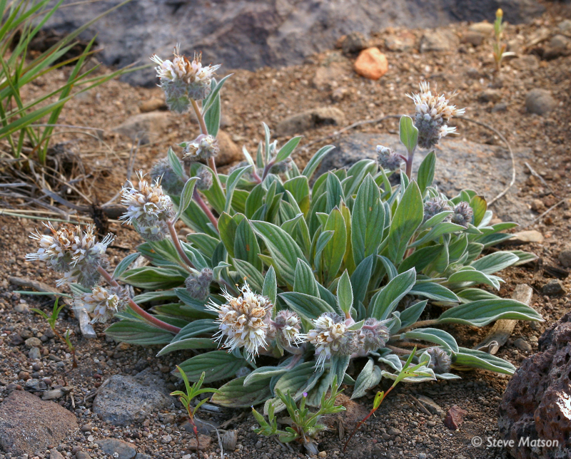
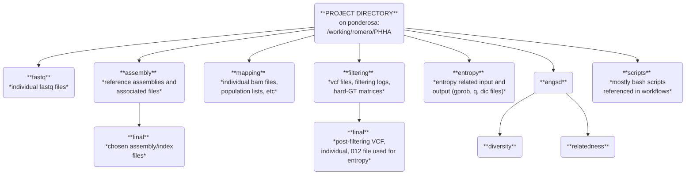

# ***Phacelia hastata*** (silverleaf scorpionweed)

     

## Ponderosa directory organization

## Git organization

`workflows` will have markdowns related to processses on ponderosa. Things like:
    
+ fastq --> GT calls (assembly, mapping, variant calling, filtering)
+ running entropy
+ running angsd
+ anything that generates intermediate files or output files needed for statistical analyses

All other analyses can be organized into associated directory (e.g. maps, population structure, ancestry, diversity, relatedness, GEA, phylogeny, etc.). These would hold things like:

+ input statistical files (e.g. genotype probability matrices, diversity estimates by population, etc.)
+ Rmarkdown/Python scripts for stats or figure making
+ Output figures - but be conscious about file sizes if they're exploratory. Total repo size shouldn't exceed ~ 1 GB

## Latex organization

Will add to later depending on how we want to organize. We should have seemless integration between Github, Overleaf, and Zotero (or whatever citation manager we prefer).
